<h1 align="center">Hi, I'm Mekan Sari! 👋 
<small style="font-size: 0.5em;">Full-Stack Developer</small></h1>

<h3 align="center">:hammer_and_wrench: Languages and Tools</h3>

  

  

<table width="100%">
  <tr>
    <td width="50%" align="center" valign="top">
      
    </td>
    <td width="50%" valign="top">
      <h3>🧑‍💻 About Me</h3>
      

        I'm a passionate software developer with a strong background in cloud computing, game development, and full-stack web development. 
        I have a keen interest in solving complex problems and building scalable solutions. When I'm not coding, you can find me engaged 
        in physical activities like swimming and judo, or planning my next adventure.
      

      <h3>📫 Contact</h3>
      

      
        
        
        
      

    </td>
  </tr>
</table>